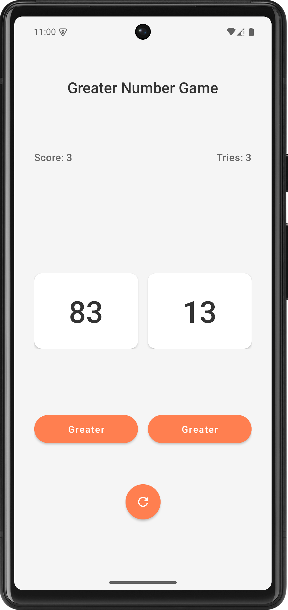

# Greater Number Game 🎮

A simple and fun Android game where players guess which of the two numbers is greater. Built with **Kotlin** and **Material Design**, this project demonstrates clean UI design, state management, and basic game logic.

## Features ✨
- **Dynamic Number Generation**: Random numbers are generated for each round.
- **Score Tracking**: Keep track of your score as you play.
- **Tries Counter**: See how many attempts you've made.
- **Reset Button**: Easily restart the game with a single tap.
- **Material Design**: Beautiful and responsive UI using Material Components.

## Screenshots 📸


## Technologies Used 🛠️
- **Kotlin**: Primary programming language.
- **Material Design**: For a modern and polished UI.
- **ConstraintLayout**: For flexible and responsive layouts.
- **MaterialCardView**: For stylish number cards.
- **MaterialButton**: For interactive and visually appealing buttons.

## How to Play 🕹️
1. Two random numbers are displayed on the screen.
2. Tap the button below the number you think is greater.
3. If you're correct, your score increases! If not, the game continues.
4. Use the reset button to start over at any time.

## Installation ⚙️
You can get the app in two ways:

1. Download from Releases:
   - Go to the [Releases](https://github.com/asiradnan/Greater-Number-Game/releases) page
   - Download the latest APK file
   - Install directly on your Android device

2. Build from source:
   ```bash
   git clone https://github.com/asiradnan/Greater-Number-Game.git
    ```
   - Open the project in Android Studio.
    - Build and run the app on an emulator or physical device.
## Contributing 🤝
Contributions are welcome! If you find any bugs or want to add new features, feel free to open an issue or submit a pull request.
## License 📄
This project is licensed under the MIT License. See the LICENSE file for details.